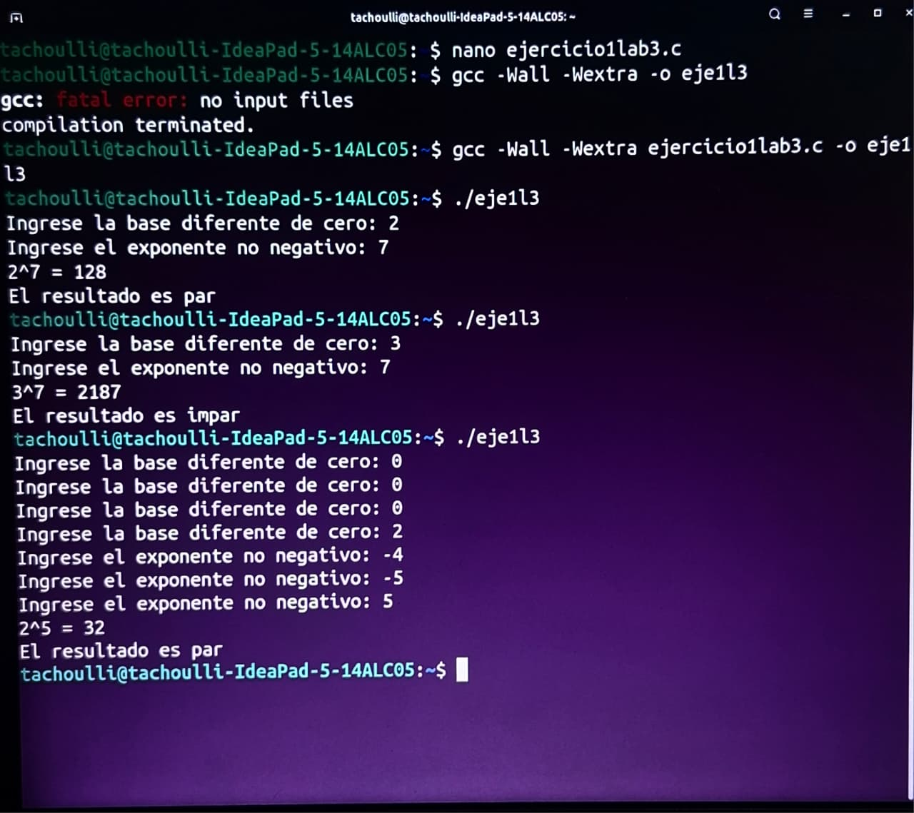
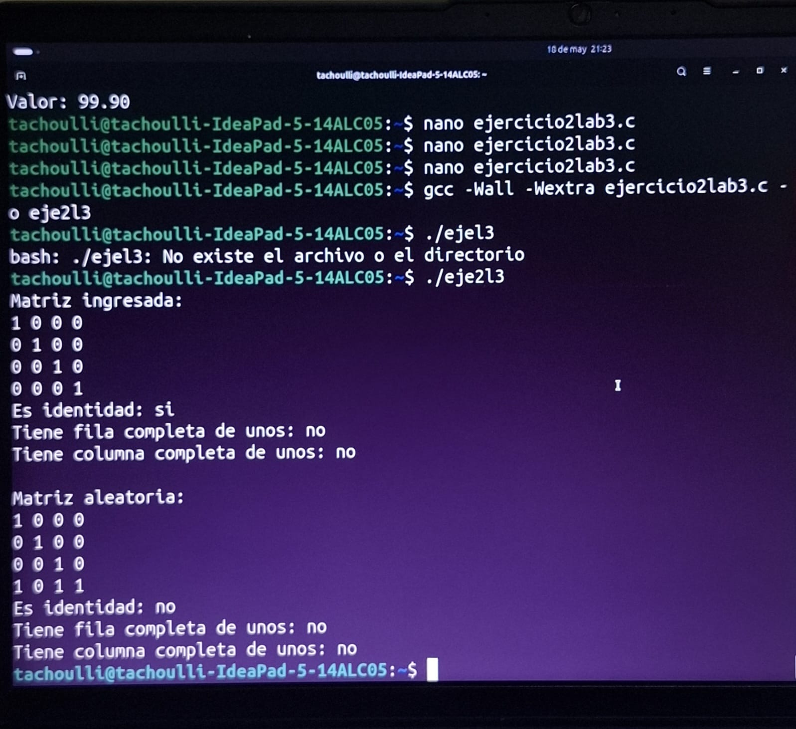
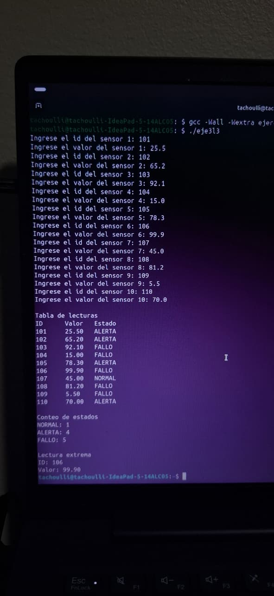

# Laboratorio 3

**Curso:** Programación bajo plataformas abiertas  
**Estudiante:** Harim Uriel Méndez Gómez
**Repositorio:** https://github.com/tachoulli/Lab3

---

# Introducción

En este laboratorio se trabajó con programación en C utilizando funciones, validación de datos, matrices, estructuras y enumeraciones. También se utilizó GitHub para respaldar y organizar el código desarrollado.

---

# Ejercicio 1

En este ejercicio se corrigió un error en el código original para calcular potencias.

El problema era que dentro del ciclo se redeclaraba la variable del exponente, lo que hacía que el programa no funcionara correctamente. Se corrigió ese error y luego se modificó el programa para que el usuario pudiera ingresar la base y el exponente.

También se agregó validación para evitar exponentes negativos y base igual a cero.

Finalmente se implementó una función para determinar si el resultado obtenido era par o impar.

## Evidencia

---

# Ejercicio 2

En este ejercicio se trabajó con matrices binarias.

Se implementaron funciones para contar unos en filas y columnas, verificar si una matriz era identidad y comprobar si existía alguna fila o columna compuesta completamente por unos.

Primero se probó con una matriz identidad definida manualmente y luego con una matriz generada aleatoriamente.

Los resultados obtenidos coincidieron con lo esperado.

## Evidencia

---

# Ejercicio 3

En este ejercicio se desarrolló un sistema sencillo para registrar lecturas de sensores.

Cada sensor almacena un identificador, un valor y un estado.

Los estados utilizados fueron:

- NORMAL
- ALERTA
- FALLO

Dependiendo del valor ingresado, el programa clasifica automáticamente cada lectura.

Además, se contó cuántos sensores había en cada estado y se identificó la lectura más alejada del valor central.

El programa funcionó correctamente con los datos de prueba ingresados.

## Evidencia

---

# Conclusión

Este laboratorio permitió practicar varios conceptos importantes de programación en C, especialmente el uso de funciones, matrices y estructuras.

También sirvió para reforzar el uso de GitHub como herramienta para organizar y respaldar el código.
